# CS464 Assignment 01 · Abdullah Saeed · BSCS25067
## Game 1 · Blasphemous
- **Store link:** [\[Google Play Link\]](https://play.google.com/store/apps/details?id=com.thegamekitchen.blasphemousmobile&hl=en)
- **Genre:** 2D, Metroidvania, Soulslike, Action platformer
- **I played:** around 3-4 hours of total gameplay
- **Video (optional):** None

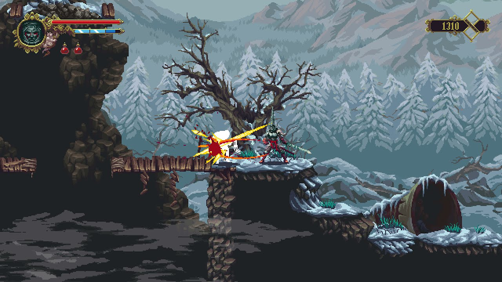
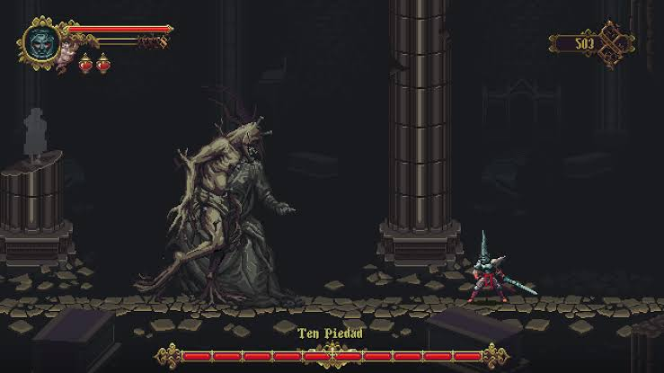
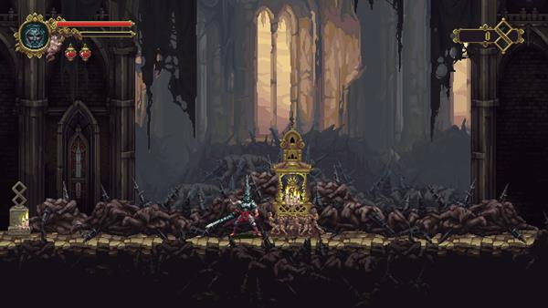

| # | Mechanic | Dynamic | Aesthetic | Bartle type |
|---|---|---|---|---|
| M1 | Melee combat with the Mea Culpa sword (light combo attacks, plus downward and upward strikes) | Players learn enemy attack ranges and trade hits at spacing they choose, deciding between aggression and retreat | Challenge | Achiever |
| M2 | Dodge and parry/riposte | Reading enemy tells and timing a counter creates risk-reward tension; a mistimed parry is punished, a clean one is rewarded with a free kill | Challenge, Sensation | Achiever |
| M3 | Prie-Dieu checkpoints with enemy respawn and a death penalty (Guilt Fragment, lost Tears of Atonement) | Players weigh pushing deeper against retreating to bank progress, and feel dread when carrying a lot of currency | Challenge, Sensation | Achiever |
| M4 | Interconnected map with ability-gated areas (wall-climb, dash, etc.) | Players spot locked paths, remember them and return later, so the world opens up gradually | Discovery | Explorer |
| M5 | Collectibles and build customization (rosary beads, prayers, relics, sword hearts) | Players hunt for items and experiment with loadouts to suit their playstyle | Expression, Discovery | Explorer |
| M6 | Environmental and item-description lore, cryptic NPC dialogue, cutscenes | Players piece together the story themselves from fragments, since nothing is explained outright | Narrative | Explorer |
| M7 | Multi-phase boss fights | Players learn attack patterns by trial and error, then execute them under pressure; each win marks a milestone | Challenge, Narrative | Achiever |

**Aesthetic profile:** Challenge, Discovery, Narrative, Sensation

**Player types**
- Primary: Explorer (interacting × world), because the map structure, collectibles and lore (M4, M5, M6) reward curiosity and the push to uncover every region.
- Secondary: Achiever (acting × world), because the combat, boss fights and checkpoint penalty (M1, M2, M3, M7) reward mastery and clearing hard goals.

## Game 2 · Among Us
- **Store link:** [\[Google Play Link\]](https://play.google.com/store/apps/details?id=com.innersloth.spacemafia&hl=en)
- **Genre:** Multiplayer, Social deduction, Party game
- **I played:** around 1-2 hours of total gameplay
- **Video (optional):** None

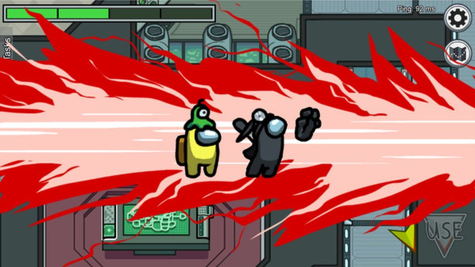
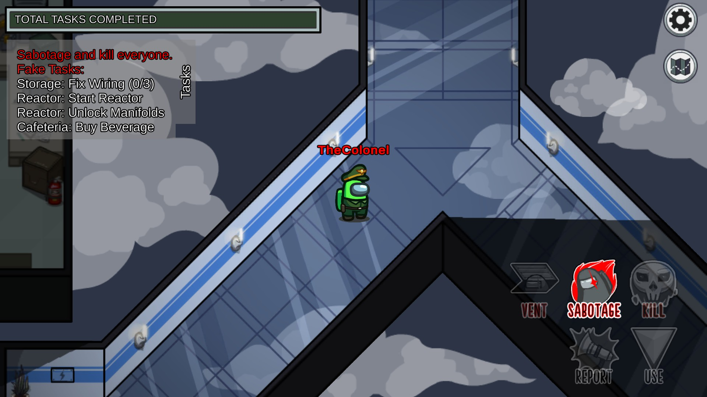
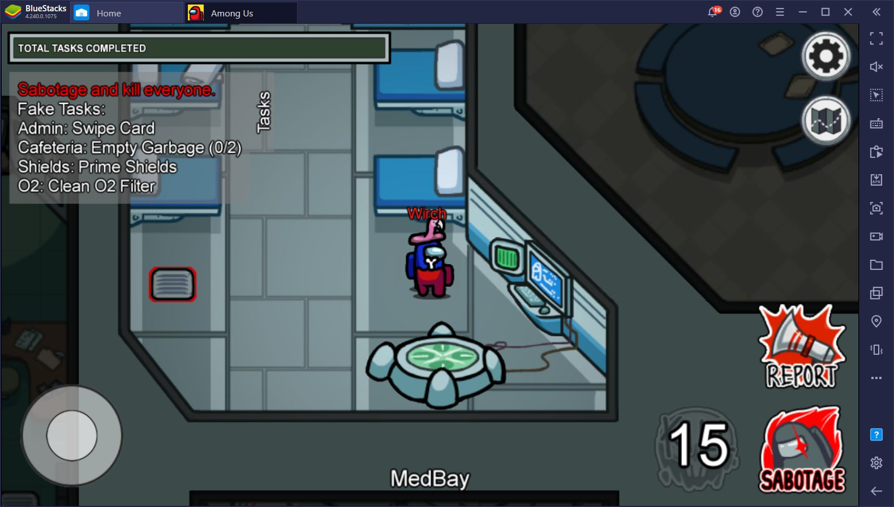

| # | Mechanic | Dynamic | Aesthetic | Bartle type |
|---|---|---|---|---|
| M1 | Each Crewmate gets a fixed set of short tasks around the map, and every completed task fills a shared bar; a full bar wins the round for the crew. | Crewmates move room to room doing tasks in view of others, and use a task as an alibi when someone is accused. | Challenge: the crew is racing the Impostors' kills, so every task done is progress against a clock. | Achiever |
| M2 | An Impostor can kill a Crewmate in close range, then must wait out a cooldown before the next kill. | Impostors tail a lone player until no one is watching, and crewmates start moving in pairs to avoid being the only one in a room. | Fantasy: you play the hidden killer among friends. | Killer |
| M3 | Impostors can enter a vent in one room and exit from another, and only they can use vents. | Impostors vent right after a kill to escape the scene, and crewmates who see one emerge have proof. | Challenge: a getaway only works if no one is looking, so you are always judging risk. | Killer |
| M4 | Reporting a body or pressing the emergency button pulls everyone into a timed text-chat meeting. | Players state where they were and who they saw, then compare stories to catch a contradiction. | Fellowship: the table talk is the game, and the group has to reach a verdict together. | Socializer |
| M5 | After each meeting a vote runs, and the player with the most votes is ejected; a tie or skip ejects no one. | Players gang up on the quiet or the loudest player, and Impostors join the pile-on to deflect suspicion. | Challenge: a wrong vote removes an innocent, so every accusation is a gamble. | Killer |
| M6 | Impostors can trigger sabotage (reactors, oxygen, lights); some give the crew a countdown to fix, and lights shrinks crewmate vision. | Crew rush to the fix points and leave tasks and bodies, so Impostors time a kill while the crew is pulled apart. | Sensation: the alarm and shrunken vision raise tension. | Killer |
| M7 | A lobby uses a room code, and the host sets the rules (number of Impostors, kill cooldown, player speed). | Friend groups tune the settings to make rounds harder or sillier, then replay. | Fellowship: the lobby is a place to hang out with the same group. | Socializer |

**Aesthetic profile:** Fellowship and Challenge. A little bit of Fantasy and Sensation.

**Player types**
- Primary: Socializer (interacting × players), because the game is decided in meetings (M4) and played in friend lobbies (M7). It's the players axis because the opponents and the puzzle are other people, and it's the interacting axis because you read, talk and persuade instead of beating a system.
- Secondary: Killer (acting × players), because the Impostor's kills, vents, sabotage and the vote (M2, M3, M5, M6) are all ways of imposing an effect on other players. It's the acting axis because you act on them, not just engage with them.

## Level blockouts
| Level | Screenshot | Its idea | Wayfinding tool |
|---|---|---|---|
| Level01 | 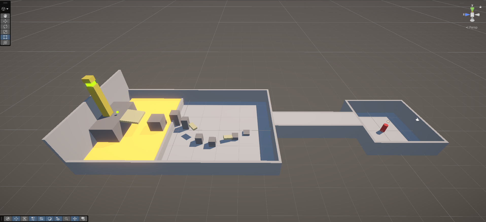 | Mario-style run: spawn room, a long connecting tunnel, then a big yard to the goal tower. | Landmark: a tall yellow tower beside the goal, with a yellow orb next to it. |
| Level02 | 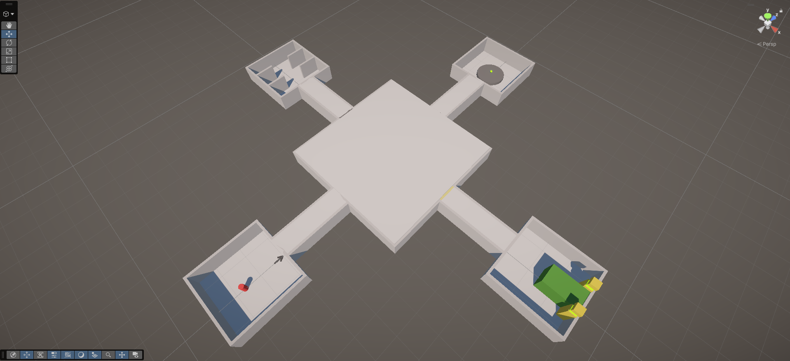 | Among Us-style hub: three corridors leave the hub, and only one leads to the reactor (the goal) while the other two end in reward rooms. | Light and contrast: the correct room bright colors and lighting and the other two are greyish. |
| Level03 | 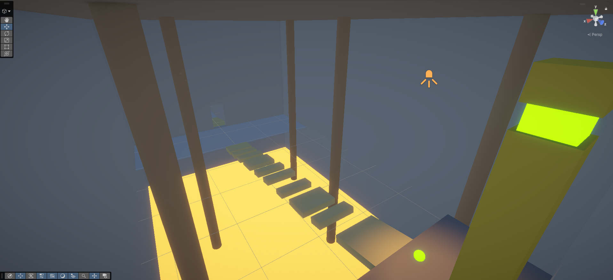 | | |
| Level04 | 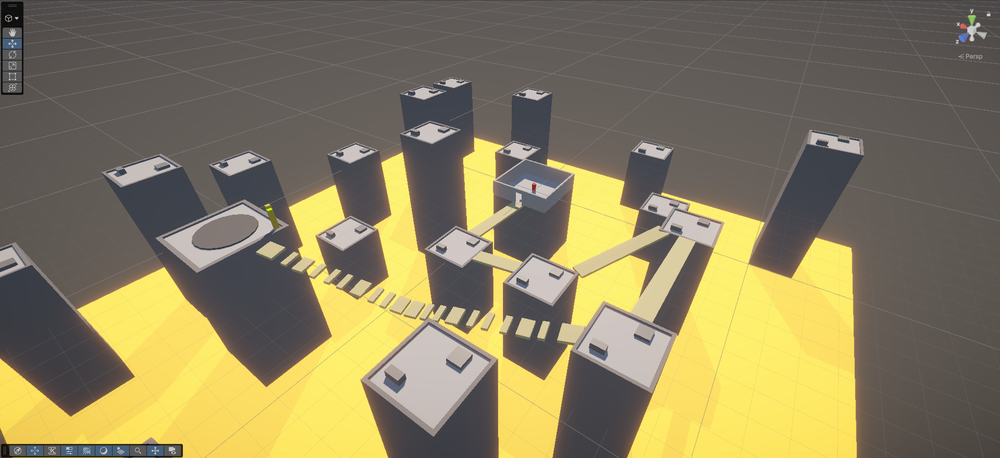 | | |
| Level05 | 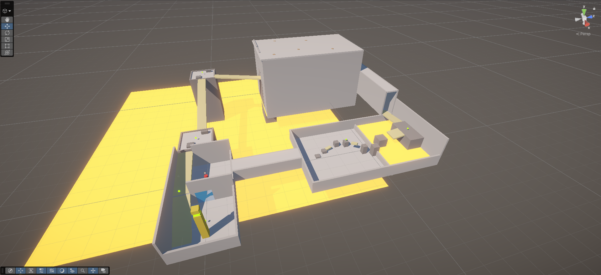 | | |